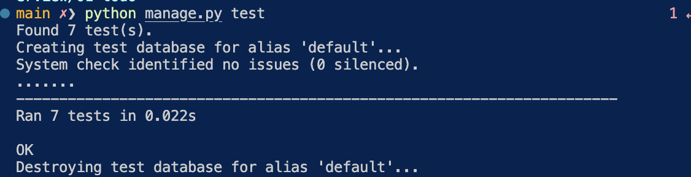

# Module 1 — Introduction to Vibe Coding / AI Tools overview

## Reference links

[video](https://www.youtube.com/watch?v=NSMXQk4Axig&list=PL3MmuxUbc_hLuyafXPyhTdbF4s_uNhc43)
[Original repo](https://github.com/DataTalksClub/ai-dev-tools-zoomcamp/tree/main/01-overview)

## Notes

### Initial

**Vibe coding**: let AI to create code and you don't really care which is inside and it appars to work.

Tools:
Python for backend and JavaScript for frontend.

Sharing community:

- Extra points for publishing your work on social media:
  - [LinkedIn](./images/share-in-linkedin.png)

**Build a snake application with AI tools**: We will build a snake game using svelte and python.

- Prompt: "Create a snake game using svelte".

### Coding assistants that work outside your IDE

- With chatGPT, you must be sure that the model was trained with the version packages you are using. Ask for the modern versions of the packages and follow th instructions to deploy the application in vscode.

- With Claude, we use WASP controls adding a complement prompt: "I want to use WASP for controlling the snake also i want to have two models: walls and pass-through". Download the app to ask claude of "how to run locally".

The problem with the assistants above is that you ask and have to paste manually in your code editor.

### Coding assistants that work inside your IDE

- Claude code is a **code cli**, and use its terminal commands to build an app. And the end will give you the costs, tokens, and time used to build the app.
In app data

- With copilot, give the prompt and the app runs but something happened with the app initialization *related to an old svelte versions*. So i copy the error message of the browser console and paste it back to copilot asking to fix the error. Copilot fixed the error and the application runned. Also i asked to do some refactorings like removing the logic into a separate component with this prompt: "Let's refactor it and put the logic into a snake component".

- With cursor, its IDE is similar to VS code.

### Project Bootstapers

Use templates that guide you to create an app faster.

- **Lovable**

- You can make some initial phases in your project using *Lovable*, then download the project and continue working with copilot.

### Agents

- Some agents can interact with your desktop environment so it can use your browser to make tedious tasks like search pictures of cats.

```bash
export ANTHROPIC_API_KEY="your_anthropic_api_key_here"
docker run \
  -e ANTHROPIC_API_KEY=$ANTHROPIC_API_KEY \
  -v $HOME/.anthropic:/home/computeruse/.anthropic \
  -p 5900:5900 \
  -p 8501:8501 \
  -p 6080:6080 \
  -p 8080:8080 \
  -it ghcr.io/anthropics/anthropic-quickstarts:computer-use-demo-latest
 ```

- Or create your own agent to automate pull requests, reviews and suggestions.

## Homework

- The homework is in [01-overview/homework.md](01-overview/homework.md)

- Here is how to run the [homework](01-overview/01-todo/README.md)

- Important prompt for tests: "Cover the fuctionality with tests: which scenarios we should cover, make sure they make sense, implement and run them"

  - Run the tests with: `python manage.py test`
  
